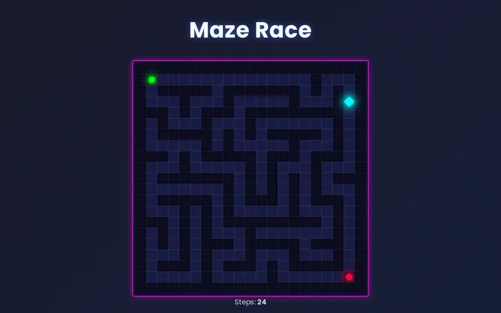
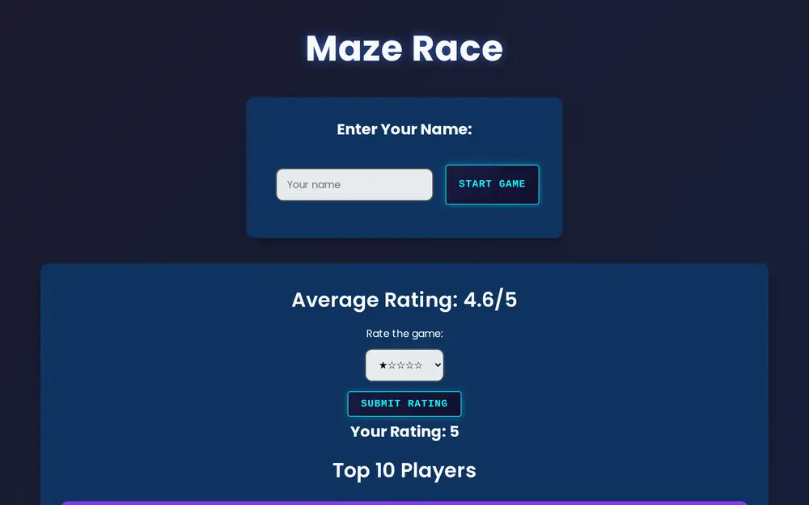
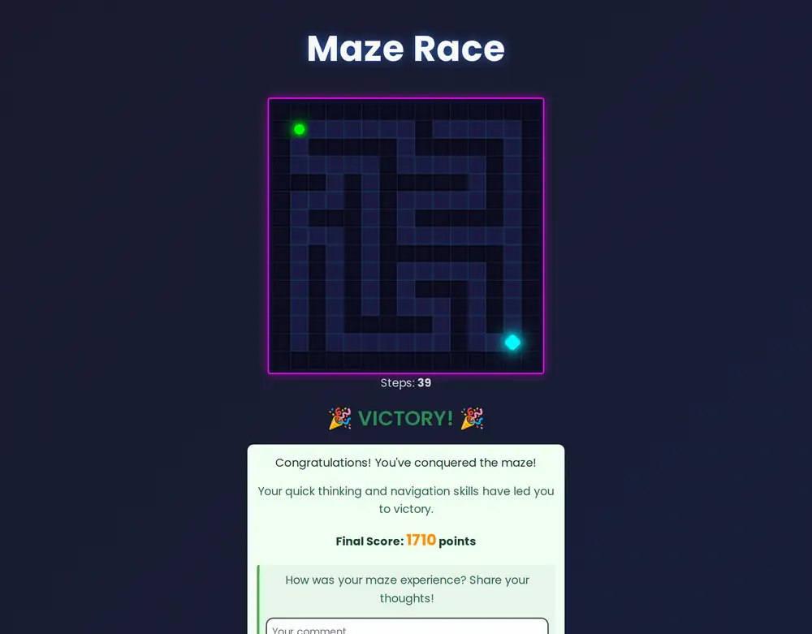

# 🧩 Maze Racer

A web maze game built with **Java 17, Spring Boot and Thymeleaf**. Enter your name, pick a difficulty and find the way out of a randomly generated maze with the `W` `A` `S` `D` keys. The fewer steps you take, the higher your score. Scores, comments and ratings are stored in **PostgreSQL** and are also available through a **REST API**.



## Features

- **Random maze generation**: a depth-first "recursive backtracker" algorithm, so every maze is different and always solvable
- **Three difficulties**: Easy 15×15, Medium 21×21, Hard 31×31, each with its own scoring formula (base points minus a penalty per step)
- **Keyboard controls** (`W` `A` `S` `D`) and a live step counter
- **Top 10 leaderboard** that shows each player's comment
- **Comments and 1–5 star ratings**, with the average rating shown on every page
- **REST API** for scores, comments and ratings
- **Two persistence implementations** behind the same service interfaces: plain **JDBC** and **Spring Data JPA / Hibernate**
- **Console client** that uses the REST API through `RestTemplate` (Spring app without a web server)
- Dark neon "cyber-maze" UI

## Screenshots

| Start | Choose difficulty | Victory |
|---|---|---|
|  |  |  |

## Tech stack

| Layer | Technologies |
|---|---|
| Language | Java 17 |
| Backend | Spring Boot 3 (Web, Data JPA), REST controllers |
| Frontend | Thymeleaf templates, HTML, CSS, vanilla JavaScript |
| Database | PostgreSQL, Hibernate (JPA), JDBC |
| Build & tests | Maven, JUnit |

## Architecture

```
gamestudio/src/main/java/sk/tuke/gamestudio/
├── core/          # game logic: Maze, MazeGenerator, Player, Position, Direction
├── entity/        # JPA entities: Score, Comment, Rating
├── service/       # service interfaces + JDBC and REST-client implementations
│   └── repository/  # Spring Data JPA repositories and JPA implementations
├── server/
│   ├── controller/  # MazeRaceController: web UI (session-scoped game state)
│   └── webservice/  # REST API: ScoreServiceRest, CommentServiceRest, RatingServiceRest
└── consoleui/     # console version of the game
```

The game logic in `core/` does not depend on Spring. The web controller, the console UI and the tests all use it through the same `ScoreService`, `CommentService` and `RatingService` interfaces. Because of that, the storage (JDBC, JPA or REST) can be swapped with a single `@Bean`.

## REST API

| Method | Endpoint | Description |
|---|---|---|
| `GET` | `/api/score/{game}` | Top scores |
| `POST` | `/api/score` | Add a score |
| `GET` | `/api/comment/{game}` | All comments |
| `POST` | `/api/comment` | Add a comment |
| `GET` | `/api/rating/{game}` | Average rating |
| `GET` | `/api/rating/{game}/{player}` | A player's rating |
| `POST` | `/api/rating` | Set a rating |

Example requests are in [`gamestudio/test-rest.http`](gamestudio/test-rest.http).

## Running locally

**Requirements:** JDK 17+, PostgreSQL.

1. Create the database:
   ```sql
   CREATE DATABASE gamestudio;
   ```
2. Set your DB credentials in `gamestudio/src/main/resources/application.properties` if needed:
   ```properties
   spring.datasource.url=jdbc:postgresql://localhost:5432/gamestudio
   spring.datasource.username=postgres
   spring.datasource.password=your_password
   ```
   Tables are created automatically (`spring.jpa.hibernate.ddl-auto=update`).
3. Start the server:
   ```bash
   cd gamestudio
   ./mvnw spring-boot:run        # Windows: mvnw.cmd spring-boot:run
   ```
4. Open **http://localhost:8080/maze**

## How to play

1. Enter your name and press **Start Game**.
2. Choose **Easy**, **Medium** or **Hard**.
3. Move with `W` `A` `S` `D` from the green start to the red exit.
4. After you win, leave a comment and rate the game. Your score appears in the Top 10.

## Author

**Rostyslav Matsko** · [GitHub](https://github.com/rostyslav109) · [LinkedIn](https://www.linkedin.com/in/rostyslav-matsko-75188b25b/)

Built during my studies at the Technical University of Košice (TUKE).
